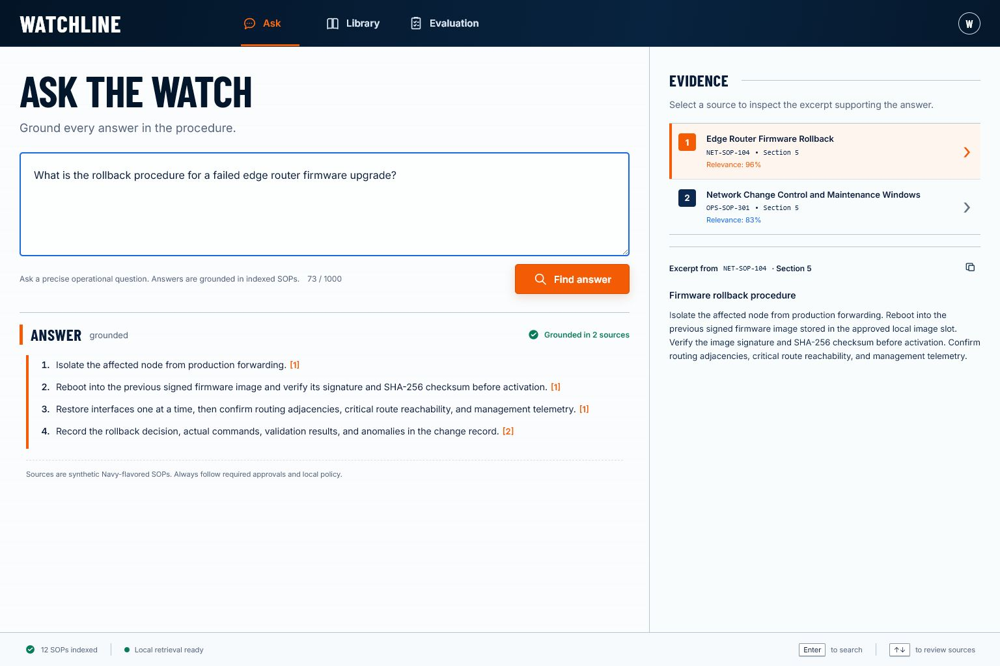
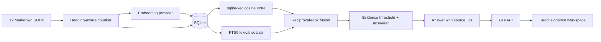

# Watchline — citation-first SOP assistant

Watchline is a full-stack retrieval-augmented generation application over 12 synthetic, unclassified, Navy-flavored technical SOPs. It retrieves procedure sections with hybrid search, answers only when the corpus supports an answer, and exposes every supporting excerpt as a clickable citation.



## Why this project exists

The useful question for a retrieval assistant is not “can it produce prose?” It is “can a user see why this answer is trustworthy, and can an engineer measure when it is not?” Watchline makes retrieval, refusal, citations, and evaluation first-class product behavior.

## Architecture



The ingestion path preserves each document's title, section number, heading, and stable chunk key. Search combines cosine nearest-neighbor results from `sqlite-vec` with weighted FTS5 matches, then fuses both rankings. Low-evidence questions are refused. Supported answers carry numbered citations that map directly to returned excerpts.

The default `auto` mode uses OpenAI embeddings and generation when `OPENAI_API_KEY` is present. Without a key, Watchline uses a deterministic local hash embedding and extractive answerer, keeping development, tests, and evaluation free and reproducible.

## Evaluation

The checked-in suite contains 20 question/expectation pairs spanning all 12 SOPs, guardrail questions, and one unsupported question. A supported case passes only when it returns the expected source, recalls at least half of the required answer details, and remains grounded. The unsupported case passes only when the assistant refuses and returns no sources.

| Metric | Local deterministic baseline |
| --- | ---: |
| Cases passed | **20 / 20** |
| Pass rate | **100%** |
| Expected-source hit rate | **100%** |
| Average keyword recall | **93.3%** |

The evaluator exits non-zero below an 85% pass rate and writes auditable per-case results to [`backend/evals/latest-report.json`](backend/evals/latest-report.json).

Run it with:

```powershell
cd backend
python evaluate.py
```

## Run locally

Requirements: Python 3.11+, Node.js 22+, and npm.

Terminal 1 — API:

```powershell
cd backend
py -3.11 -m venv .venv
.venv\Scripts\Activate.ps1
python -m pip install -r requirements-dev.txt
python -m uvicorn app.main:app --reload
```

Terminal 2 — web client:

```powershell
cd frontend
npm install
npm run dev
```

Open `http://127.0.0.1:5173`. FastAPI's interactive API documentation is at `http://127.0.0.1:8000/docs`.

To use the hosted-model path in PowerShell:

```powershell
$env:OPENAI_API_KEY = "your-key"
$env:WATCHLINE_EMBEDDINGS = "openai"
$env:WATCHLINE_GENERATION = "openai"
python -m uvicorn app.main:app --reload
```

Do not commit a real key. [`.env.example`](.env.example) documents every runtime setting.

## API surface

| Method | Route | Purpose |
| --- | --- | --- |
| `GET` | `/api/health` | Corpus size and active providers |
| `GET` | `/api/documents` | Indexed SOP summaries |
| `POST` | `/api/ask` | Grounded answer and source excerpts |
| `POST` | `/api/reindex` | Rebuild the corpus index |

## Verification

```powershell
cd backend
python -m pytest
python -m ruff check .
python evaluate.py

cd ..\frontend
npm run lint
npm run build
```

The current verification baseline is 6 passing backend tests, 20 passing evaluation cases, a clean Ruff/ESLint run, and a successful production frontend build. Tests cover chunk metadata, retrieval relevance, grounded API answers, citations, and no-evidence refusal.

## Repository map

```text
backend/app/          FastAPI, chunking, providers, hybrid retrieval, answer policy
backend/evals/        20-case evaluation set and checked-in report
backend/tests/        Unit and API tests
data/sops/            12 synthetic Markdown procedures
frontend/src/         React application and evidence-first interface
docs/                 Verified desktop/mobile captures
```

All procedure content is fictional and unclassified. It is designed to resemble operational documentation without reproducing real instructions, credentials, systems, or sensitive material.

## What I would do differently with more time

1. Add retrieval and answer-quality traces with latency and token-cost breakdowns.
2. Expand the evaluator with adversarial paraphrases, citation-entailment checks, and regression thresholds by intent.
3. Replace the single-process reindex swap with versioned indexes and atomic promotion.
4. Add authentication, role-scoped corpora, audit events, and rate limits before handling real procedures.
5. Deploy a preview environment and run the same evaluation against each release candidate.
